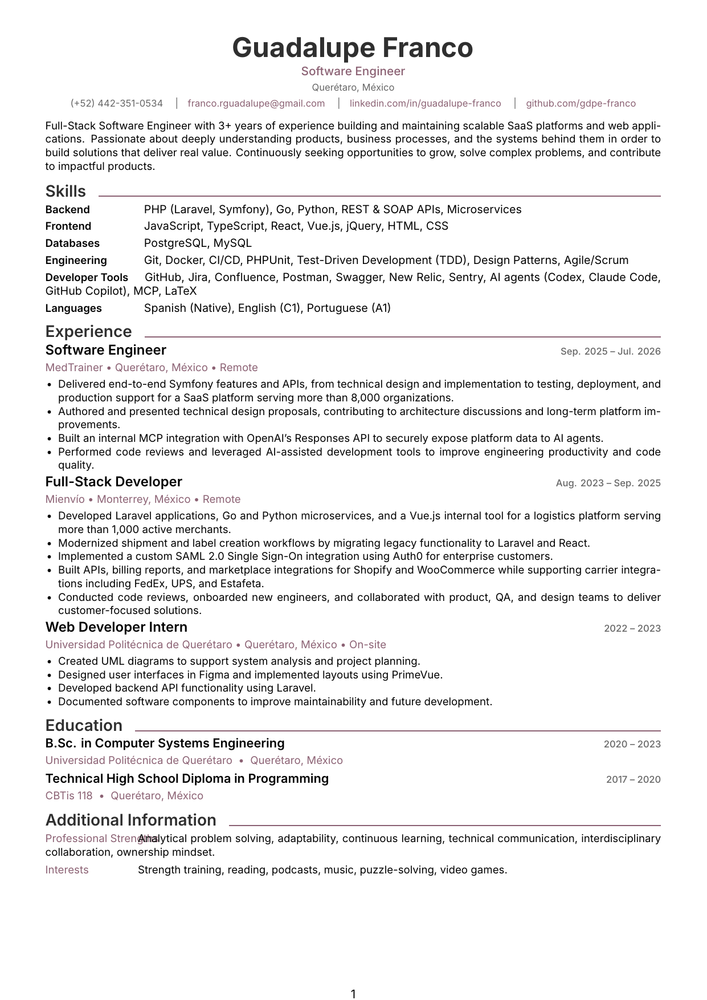

# Career Documents

LaTeX source for Guadalupe Franco's CV and future tailored job-application documents.

## Preview



## Build the CV

```bash
latexmk -xelatex -interaction=nonstopmode -file-line-error cv.tex
```

This creates `cv.pdf`.

## Project layout

```text
cv.tex        CV entry point
preamble.tex  Shared layout, fonts, and colors
macros.tex    Shared formatting commands
sections/     CV content by section
fonts/        Bundled fonts
assets/       README preview image
```

## Create another document

Add a new entry file beside `cv.tex`, such as `backend-resume.tex` or `cover-letter.tex`. Reuse `preamble.tex` and `macros.tex`, then include only the sections needed for that document.
